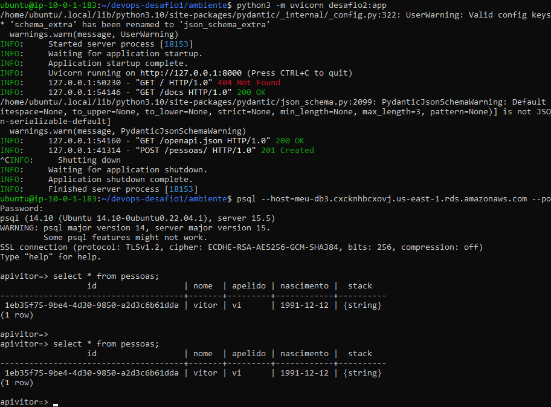

#Configuração da instancia ec2 e banco de dados RDS.

Após criar a infra com terraform:

1- Fazer a conexao ssh com a instancia ec2.

2- No meu ambiente wsl, no diretorio .ssh, colar o comando de acesso a ec2, e ter acesso a instancia.

3 - Após acessar a instancia ec2, atualizar os pacotes com o seguinte comando:

sudo apt-get update

Apó alguns segundos, os pacotes serão atualizados.

4 - Instalar o python3-pip e o ngnix, com a flag -y, para ser sim a resposta de todas as perguntas:

sudo apt install -y python3-pip nginx

5 - Criar o arquivo no seguinte caminho, para configurar o servidor quando der o start no nginx:

sudo vi /etc/nginx/sites-enabled/fastapi_nginx

Configurar o nginx.

server {

        listen 80;

        server_name 44.204.7.27; # ip publico da ec2

        location / {

                proxy_pass http://127.0.0.1:8000;

        }

}

E salvar o arquivo com esc :wq

Reestart o nginx com o seguinte comando, para valer as alterações:

sudo service nginx restart

6 - Clonar o repositorio do desafio 1:

Primeiro gerar uma chave publica para isso: ssh-keygen e add no azure devops

git clone repositório

Diretorio clonado, entrar no diretorio.

Criar o arquivo requirements.txt e colocar oque é preciso instalar:

sudo vi requirements.txt

annotated-types==0.6.0

anyio==4.2.0

async-timeout==4.0.3

asyncpg==0.29.0

click==8.1.7

colorama==0.4.6

fastapi==0.109.2

h11==0.14.0

idna==3.6

psycopg2-binary==2.9.9

pydantic==2.6.1

pydantic_core==2.16.2

python-dotenv==1.0.1

sniffio==1.3.0

starlette==0.36.3

tinydb==4.8.0

typing_extensions==4.9.0

uvicorn==0.27.0.post1

python-dotenv==1.0.1

Instalar:

pip3 install -r requirements.txt

Iniciar o ambiente para rodar o servidor:

python3 -m uvicorn desafio2:app

Conectar a ec2 pelo ip publico.

Instalar o clinte postgres.

sudo apt install postgresql

Criação de 2 arquivos .sql, para criar o database e criar a tabela, e executar esses arquivos.

create.sql = cria o database:

CREATE DATABASE apivitor;

COMMIT

createtable.sql = cria a tabela:

CREATE EXTENSION IF NOT EXISTS "uuid-ossp";  -- Importa a extensão uuid-ossp

CREATE TABLE pessoas (

            id UUID DEFAULT uuid_generate_v4(),  -- Define ID_Autor como UUID e gera automaticamente com uuid_generate_v4

            ()

            nome VARCHAR(100) NOT NULL,

            apelido VARCHAR(32) UNIQUE NOT NULL,

            nascimento DATE,

            stack VARCHAR(32)[]  -- Define Stack como uma lista (array) de strings

);

Acessar o banco:

psql --host=meu-db3.cxcknhbcxovj.us-east-1.rds.amazonaws.com --port=5432 --username=vitor --password --dbname=apivitor

Imagem da finalização do processo, com sucesso, iniciando o ambiente, acessando a api pelo ip publico da instancia ec2 e

inserindo um cadastro no banco rds postgres.

